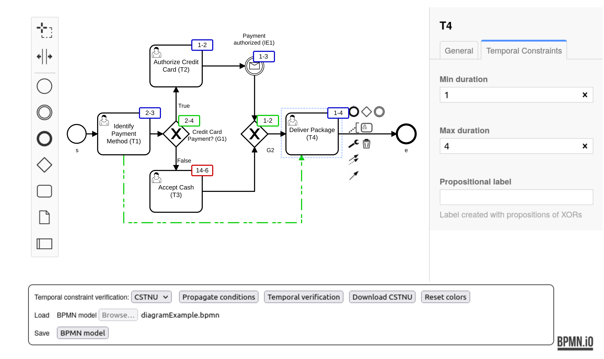

# TimeAwareBPMN-js

It is a tool for editing and verifying time-aware BPMN models, BPMN models having temporal constraints.

It is a web-application and consists of a graphical editor ([bpmn.io](https://bpmn.io/toolkit/bpmn-js/)) where it is possible to create or edit time-aware BPMN models
and to select and run a plug-in for *verifying* temporal constraints.

Plug-in architecture allows the execution of different programs for verifying different temporal properties.

As a proof-of-concept, the application contains the *CSTNU plug-in*, that allows verifying if the model is *dynamically controllable*,
i.e., it is possible to execute it whatever the duration of some activities, called *contingent* activities.
Each contingent-activity duration is limited to stay in a temporal range, but the exact duration is decided at run-time by the external "agent" executing it.
CSTNU plug-in verifies the dynamic controllability property using an external Java library.


## Installation
To run the application, it is necessary [Node.js](https://nodejs.org/) and to install some Node.js modules and dependency.

1. First, it is necessary to install **Java** module, necessary for the CSTNU plug-in.
    
    **Installation in Mac OS X**
    > 1. Install JDK 11 or 17 (if you are using brew, `brew install openjdk@11` for JDK 11)<br>
    > 2. Set the JAVA_HOME environment variable to JDK home.<br>
    >    If you installed by brew, then the JAVA_HOME can be set for JDK 11 by<br>
    >    `export JAVA_HOME=/Library/Java/JavaVirtualMachines/openjdk-11.jdk/Contents/Home`<br>
    >    or for JDK 17 by<br>
    >   `export JAVA_HOME=/Library/Java/JavaVirtualMachines/openjdk.jdk/Contents/Home`<br>
    > 3. Install compiling tools: `npm install -g node-gyp`<br>
    > 4. Install java: `npm i java`<br>


    **Installation in Ubuntu**
    > 1. Install JDK 11 or 17
    > 2. Install compiling tools: `sudo apt install make g++`
    > 3. Install java: `npm i java`


2. Then, install all other dependencies
```
npm install
```

3. Finally, run the project
```
npm start
```

## Usage

It is possible to create a new model or load one by dragging the file in the editor or using the option Load BPMN model. 

This is an screenshot of the interface of the TimeAwareBPMN-js showing the graphical editor and the tool with bottons for the possible action. 



There are example models in the [models folder](./exmples/models/).

## Demos
[Demos folder](./examples/demos/) contains some video showing how to use the application.

## Adding a plug-in
The application can be extended, adding other plug-ins for verifying other temporal properties (or other properties).
There is an application API to ease the development of plug-in as JavaScript module.
One a plug-in is developed, it can be used inside the application, just putting the JavaScript module in a specific directory.

A plug-in is divided into two parts:
* Client-side plug-in. It has to show the possible actions as buttons in a toolbar, prepare the data for the checking, send the data to the corresponding server-side plug-in, and receive and show the results.
More details are given at page [client-side plug-in](./TA_BPMN_editor/app/temporal-modeler/temporal-plugins-client/README.md).

* Server-side plug-in. It has to accept the verification requests, realize the verification executing some program/library, and return the results to the corresponding client-side plug-in.
More details are given at page [server-side plug-in](./temporal-plugins-server/README.md).


## Contributing

Pull requests of new plug-ins and fetures in the editor are welcome. For major changes in the editor, please open an issue first to discuss what you would like to change.

## License

MIT
